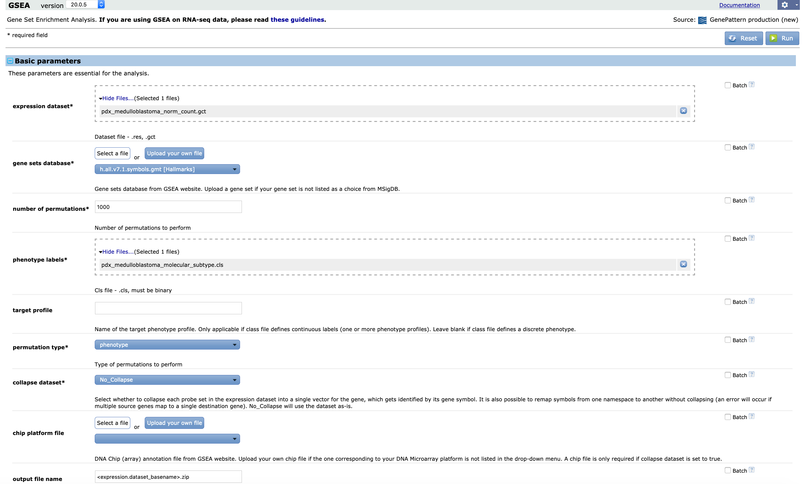

In this notebook, we'll cover some additional material related to the three kinds of pathway approaches we covered in the workshop: over-representation analysis (ORA), Gene Set Enrichment Analysis (GSEA), and Gene Set Variation Analysis (GSVA).

Specifically, we're going to cover the following:

1. Selecting a background set for ORA
2. Preparing files for phenotype permutated GSEA and some background on why we'd want to use GSEA in this way
3. Testing GSVA pathway scores for differential expression

# Set up

## Moving files around -- feel free to skip this section!

This section is for moving files around on the server to make things easier for development.
Feel free to skip to the pathway analysis sections below!

We're going to revisit the neuron marker genes from the GBM dataset from the scRNA-seq for over-representation analysis.

```{r}
# Create a directory to hold the GBM marker data for the purpose of this 
# notebook
gbm_marker_dir <- file.path("data", "gbm-marker")
if (!dir.exists(gbm_marker_dir)) {
  dir.create(gbm_marker_dir, recursive = TRUE)
}

# Location of the backup marker data during this workshop
neuron_marker_file <- file.path("~", "shared-data", "training-modules", "magic", 
                                "2020-july", "scRNA-seq", "analysis", 
                                "glioblastoma", "markers", "Neuron_markers.tsv")
# Location that it should be copied to
copied_marker_file <- file.path(gbm_marker_dir, "Neuron_markers.tsv")

# Copy to the GBM marker directory for the purpose of this notebook if it's
# not already there
if (!file.exists(copied_marker_file)) {
  file.copy(neuron_marker_file, gbm_marker_dir)
}
```

We'll use the medulloblastoma PDX data from the 2020 June workshop's first bulk RNA-seq exercise notebook.
We also use a processed version for the pathway analysis exercise notebook.

```{r}
# Directory that will hold all the data
pdx_dir <- file.path("data", "pdx-medulloblastoma")
dir.create(pdx_dir, recursive = TRUE, showWarnings = FALSE)

# Copy the tximport RDS that we used in the 2020 June bulk RNA-seq data frame
pdx_tximport_file <- file.path("/opt", "etc", "skel", "june2020", 
                               "training-modules", "RNA-seq", "data", 
                               "tximport", "medulloblastoma", 
                               "medulloblastoma_tximport.RDS")
copied_tximport_file <- file.path(pdx_dir, 
                                  "pdx_medulloblastoma_tximport.RDS")
if (!file.exists(copied_tximport_file)) {
  file.copy(pdx_tximport_file, copied_tximport_file)
}

# Metadata file
metadata_file <- file.path("~", "shared-data", "training-modules", "2020-july", 
                           "pathway-analysis", "data", "pdx-medulloblastoma", 
                           "pdx_medulloblastoma_metadata.tsv")
copied_metadata_file <- file.path(pdx_dir, 
                                  "pdx_medulloblastoma_metadata.tsv")
if (!file.exists(copied_metadata_file)) {
  file.copy(metadata_file, copied_metadata_file)
}

# Transformed RNA-seq file
vst_file <- file.path("~", "shared-data", "training-modules", "2020-july", 
                      "pathway-analysis", "data", "pdx-medulloblastoma", 
                      "pdx_medulloblastoma_vst.tsv")
copied_vst_file <- file.path(pdx_dir,
                             "pdx_medulloblastoma_vst.tsv")
if (!file.exists(copied_vst_file)) {
  file.copy(vst_file, copied_vst_file)
}
```

## Libraries

```{r}
library(magrittr)
library(msigdbr)
library(clusterProfiler)
library(fgsea)
library(GSVA)
library(limma)
library(org.Hs.eg.db)
```

```{r}
if (!("ArrayTools" %in% installed.packages())) {
  BiocManager::install("ArrayTools", update = FALSE)
}

library(ArrayTools)
```

# Pathway analysis

## Over-representation analysis (ORA)

We had some questions about selecting a background set for ORA. 
Let's revisit the neuron marker data from the scRNA-seq glioblastoma (GBM) data.

### Gene sets

We'll use the human KEGG datasets from the `msigdbr` package.

```{r}
hs_kegg_df <- msigdbr(species = "Homo sapiens") %>%
  dplyr::filter(gs_cat == "C2",  # curated gene sets 
                gs_subcat == "CP:KEGG")  # KEGG pathways 
```

### Read in and prepare marker data

**The following code should look familiar** -- it's what we used in the first pathway analysis notebook (`01-overrepresentation_analysis`)!

```{r}
neuron_markers_df <- readr::read_tsv(copied_marker_file)

# This returns a named vector which we can convert to a data frame, where
# the keys (Ensembl IDs) are the names
symbols_vector <- mapIds(org.Hs.eg.db,  # Specify the annotation package
                         # The vector of gene identifiers we want to 
                         # map
                         keys = neuron_markers_df$gene, 
                         # The type of gene identifier we want returned
                         column = "SYMBOL", 
                         # What type of gene identifiers we're starting
                         # with
                         keytype = "ENSEMBL", 
                         # In the case of 1:many mappings, return the
                         # first one. This is default behavior!
                         multiVals = "first") 

# We would like a data frame we can join to the marker stats
neuron_marker_symbols <- data.frame(
  ensembl_id = names(symbols_vector),
  gene_symbol = symbols_vector,
  stringsAsFactors = FALSE
) %>%
  # If an Ensembl gene identifier doesn't map to a gene symbol, drop that
  # row from the data frame
  tidyr::drop_na(gene_symbol)

neuron_markers_df <- neuron_marker_symbols %>%
  # Using a left join removes the rows without gene symbols because those rows
  # have already been removed in neuron_marker_symbols
  dplyr::left_join(neuron_markers_df,
                   # The name of the column that contains the Ensembl gene IDs
                   # in the left data frame and right data frame
                   by = c("ensembl_id" = "gene"))
```

### Analysis

We're again going to use the top 100 genes for each comparison as our gene set of interest.

```{r top_neuron_genes, live = TRUE}
# Select genes that are in the top 100 for at least one comparison to other
# cell types -- use gene symbols
top_neuron_genes <- neuron_markers_df %>%
  dplyr::filter(Top <= 100) %>%
  dplyr::pull(gene_symbol)

# Because genes can theoretically be listed as many times as there are other
# cell types, we need to filter to unique genes
top_neuron_genes <- unique(as.character(top_neuron_genes))
```

For our background set in the ORA notebook in the module, we used all the genes that passed the filter in the scRNA-seq module: genes that were expressed in at least 200 cells.

```{r}
detected_genes <- unique(as.character(neuron_markers_df$gene_symbol))
```

And then here's how we performed ORA with `enricher()` using `detected_genes` for our `universe` argument.

```{r kegg_ora}
kegg_ora_results <- enricher(
  gene = top_neuron_genes,  # Genes of interest
  pvalueCutoff = 0.05,  
  pAdjustMethod = "BH",  # FDR
  universe = detected_genes,  # Background set
  # The pathway information should be a data frame with a term name or 
  # identifier and the gene identifiers
  TERM2GENE = dplyr::select(hs_kegg_df,  
                            gs_name,
                            gene_symbol)
)
```

**Here's how at least two of your instructors think about what an analysis using this background set means:**

* What is over-represented in this neuron set relative to the other cell types in this experiment?
* What is over-represented of the genes that we have any power to _say anything about_ in this experiment?

In reality, these questions aren't mutually exclusive -- both are true!

Let's take a look at the significant results:

```{r}
data.frame(kegg_ora_results@result) %>% dplyr::filter(p.adjust < 0.05)
```

What ends up being included in our tests overall are the **genes in the intersection of our background set and the pathway set**.

The denominator in the `GeneRatio` column is the intersection of the genes of interest with the genes in the pathway set:

```{r}
length(
  intersect(top_neuron_genes, # unique neuron genes -- "genes of interest"
            unique(hs_kegg_df$gene_symbol))  # unique genes in KEGG
)
```

The denominator in the `BgRatio` column is the intersection of the detected genes with the genes in the pathway set:

```{r}
length(
  intersect(detected_genes,
            unique(hs_kegg_df$gene_symbol))
)
```

To use all genes in the genome as background, we skip the `universe` argument to `enricher()`.

```{r}
all_background_results  <- enricher(
  gene = top_neuron_genes,  # Genes of interest
  pvalueCutoff = 0.05,  
  pAdjustMethod = "BH",  # FDR
  TERM2GENE = dplyr::select(hs_kegg_df,  
                            gs_name,
                            gene_symbol)
)
```

This is sort of like asking "What is over-represented in neurons vs. anything in the genome?" because we assume that the KEGG pathway genes can include any genes in the genome.

Here are the results:

```{r}
data.frame(all_background_results@result) %>% dplyr::filter(p.adjust < 0.05)
```

Notice the denominator for `GeneRatio` is the same, but the denominator in `BgRatio` is now the number of unique genes in the KEGG pathway sets:

```{r}
length(unique(hs_kegg_df$gene_symbol))
```

**When we're doing an expression-based analysis, we almost always want the _first case_ where we use the genes we have any power to say anything about as our background set.** 
The "extra" 1542 background genes that are in the KEGG pathway sets may have characteristics that make them less likely to be called as significant or to be detected independent of the classification you are testing (e.g., GC content, tissue specificity).

```{r}
# Remove some things from the global environment before moving on to other 
# methods
rm(all_background_results, 
   kegg_ora_results,
   neuron_marker_symbols,
   neuron_markers_df, 
   hs_kegg_df,
   neuron_marker_file,
   copied_marker_file,
   symbols_vector,
   top_neuron_genes,
   detected_genes)
```

## Gene Set Enrichment Analysis (GSEA)

In the GSEA notebook (`02-gene_set_enrichment_analysis`), we used GSEA **preranked**, which we supplied with a list of genes by ranked some score.
Significance testing was performed by permuting the gene labels (creating random gene sets as a null comparison) 
GSEA preranked is pretty general -- it doesn't assume that the input data is derived from an expression experiment.
GSEA can also be run where, instead of permuting the gene labels, the sample or phenotype labels are permuted.
(This does assume that we're using gene expression data.)
Permuting the sample labels is advantageous in that it preserves gene-gene correlations. 
(Not accounting for these correlations can result in high Type I error; check out [Yaari et al. 2013](https://doi.org/10.1093/nar/gkt660), [Wu and Smith. 2012](https://dx.doi.org/10.1093%2Fnar%2Fgks461), and many others!)
The recommended sample size per group for permuting sample labels is 7.

### Normalized counts

Quoting from [_Using RNA-seq Datasets with GSEA_](http://software.broadinstitute.org/cancer/software/gsea/wiki/index.php/Using_RNA-seq_Datasets_with_GSEA):

> Normalizing RNA-seq quantification to support comparisons of a feature's expression levels across samples is important for GSEA. Normalization methods (such as, TMM, geometric mean) which operate on raw counts data should be applied prior to running GSEA.
> 
> Tools such as DESeq2 can be made to produce properly normalized data (normalized counts) which are compatible with GSEA.

Let's obtain normalized counts for our medulloblastoma PDX data.
We'll need the output of `tximport::tximport()`, which is saved as the RDS object and the metadata we'll pass as `colData`.

This code might look familiar -- some of it is from `RNA-seq/03b-exploratory_data_analysis_exercise.Rmd`.

```{r}
txi <- readr::read_rds(copied_tximport_file)
metadata_df <- readr::read_tsv(copied_metadata_file)
```

Reorder the metadata.

```{r}
# Here we're saving the column names of the first matrix in the tximport object.
# tximport_sample_names will tell us the order of samples in the this object 
# because samples are columns.
tximport_sample_names <- colnames(txi$abundance)

metadata_df <- metadata_df %>%
  # The levels of a factor determine how ordering is performed when we use
  # dplyr::arrange - here we're setting the levels equal to the order of the
  # samples in the tximport object txi
  dplyr::mutate(Run = factor(Run, levels = tximport_sample_names)) %>%
  # Ordering should be the same as samples in txi
  dplyr::arrange(Run) %>%
  # Convert back to a character from a factor
  dplyr::mutate(Run = as.character(Run))

all.equal(metadata_df$Run, tximport_sample_names)
```

Create a `DESeqDataSet`.

```{r}
ddset <- DESeq2::DESeqDataSetFromTximport(txi,
                                          colData = metadata_df,
                                          # Won't actually use the metadata
                                          # to inform design
                                          design = ~ 1)
```

Obtain the normalized counts.

```{r}
# Using estimateSizeFactors() will add the size factors to the ddset object
ddset <- estimateSizeFactors(ddset)
# The counts() function, when used with normalized = TRUE, will return the 
# scaled counts as a matrix
normalized_counts <- counts(ddset, normalized = TRUE)
```

Make the normalized count data a data frame to facilite identifier conversion.

```{r}
norm_counts_df <- normalized_counts %>%
  data.frame() %>%
  tibble::rownames_to_column("gene_id")
```

### Identifier conversion and collapsing duplicate identifiers

We're going to convert the Ensembl gene IDs to gene symbols.

```{r}
norm_counts_df <- norm_counts_df %>%
  dplyr::mutate(gene_symbol = mapIds(
    org.Hs.eg.db,
    # The vector of identifiers we're converting
    keys = norm_counts_df$gene_id,
    # Converting *to* gene symbol
    column = "SYMBOL",
    # Converting *from* Ensembl ID
    keytype = "ENSEMBL",
    multiVals = "first"
  )) %>%
  # Remove any rows where the Ensembl gene identifier didn't map to a gene
  # symbol
  dplyr::filter(!is.na(gene_symbol)) %>%
  # Drop the column that contains the Ensembl IDs
  dplyr::select(-gene_id) %>%
  # Make the first column the gene symbols
  dplyr::select(gene_symbol, dplyr::everything())
```

How many of the gene symbols are duplicated?

```{r}
sum(duplicated(norm_counts_df$gene_symbol))
```

For duplicated gene identifiers, average the values.

```{r}
collapsed_norm_counts_df <- norm_counts_df %>%
  # For each gene symbol
  dplyr::group_by(gene_symbol) %>%
  # Take the mean value
  dplyr::summarize_all(mean)
```

### Create files that can be used with GSEA or GenePattern

We tried to get `fgsea::fgseaLabel()` to work for these data and received an uninformative error!

```
fgseaLabel(
  pathway = hs_hallmark_list,  # list format instead of tidy format
  mat = collapsed_norm_mat,   # matrix where rownames are gene symbols
  labels = as.integer(as.factor(metadata_df$Group)),  # subtype as labels
  nperm = 1000  # number of permutations
)
```

Which produced:

```
Error in if (NR == 0) { : missing value where TRUE/FALSE needed
```

Uninformative!

So instead, we'll show you how to create the files you'd need to run GSEA on [GenePattern](https://www.genepattern.org/).

We'll need the expression data in [GCT (Gene Cluster Text) format](https://software.broadinstitute.org/cancer/software/gsea/wiki/index.php/Data_formats#GCT:_Gene_Cluster_Text_file_format_.28.2A.gct.29) and the phenotype labels for the two group comparison in the [CLS format](https://software.broadinstitute.org/cancer/software/gsea/wiki/index.php/Data_formats#CLS:_Categorical_.28e.g_tumor_vs_normal.29_class_file_format_.28.2A.cls.29).

We can use some helpful functions from the `ArrayTools` package to write these files out.
First, we need to get the expression data (normalized counts) into a special object called an `ExpressionSet` and then we can write out a GCT file.

```{r}
# Collapsed normalized counts as a matrix
collapsed_norm_mat <- collapsed_norm_counts_df %>%
  tibble::column_to_rownames("gene_symbol") %>%
  as.matrix()

# Create an ExpressionSet
pdx_expression_set <- ExpressionSet(
  assayData = collapsed_norm_mat
)

# GCT file
ArrayTools::output.gct(pdx_expression_set,
                       # We don't need the file extension, the function
                       # will add it for us
                       filename = file.path(pdx_dir,
                                            "pdx_medulloblastoma_norm_count"))
```

And now for our CLS file.

```{r}
# We need the sample identifiers as rownames
phenotype_df <- metadata_df %>%
  dplyr::select(Run, Group, treatment) %>%
  tibble::column_to_rownames("Run")

# CLS file
ArrayTools::output.cls(phenotype_df,
                       variable = "Group",
                       filename = file.path(pdx_dir,
                                            "pdx_medulloblastoma_molecular_subtype"))
```

Here's a screenshot of how we could use these files on [GenePattern](https://www.genepattern.org/):



**Some options in this screenshot to be aware of:**

- We set the `permutation type` to `phenotype`.
  This way of running GSEA is distinct from the GSEA preranked methodology we covered during the main session.
- We use `No_Collapse` option for `collapse dataset` because we've already performed the collapse step within R before writing out the GCT file.
- As of writing this, only gene sets that use gene symbols were available from the `gene sets database` dropdown menu.
  That's why we convert to gene symbols in this notebook.
- No `chip platform file` should be required because we don't need GSEA to perform a collapse step for us.

Let's clean up the environment a bit before we move on to GSVA.

```{r}
rm(normalized_counts,
   norm_counts_df,
   collapsed_norm_counts_df,
   txi)
```

## Gene Set Variation Analysis (GSVA)

Here we wanted to demonstrate a potential downstream analysis that you can use the pathway-level GSVA scores.
First we'll need to calculate GSVA scores for the Hallmark gene sets in the PDX medulloblastoma data.

### Gene sets

`gsva()` requires a list of pathways, rather than the tidy format provided by `msigdbr`. 
We can use `split()`, which creates a list of items in the first argument grouped by the second argument.

```{r}
# Retrieve the human Hallmark gene sets from msigdbr
hs_hallmark_df <- msigdbr(species = "Homo sapiens",
                          category = "H")
# Split up the genes by pathway
hs_hallmark_list <- split(as.character(hs_hallmark_df$entrez_gene), 
                          hs_hallmark_df$gs_name)
```

### RNA-seq data

We'll read in the RNA-seq data, convert the gene identifiers to Entrez IDs, and then collapse duplicated identifiers.

```{r}
rnaseq_df <- readr::read_tsv(file.path(pdx_dir, "pdx_medulloblastoma_vst.tsv")) 
rnaseq_df <- rnaseq_df %>%
  dplyr::mutate(entrez_id = mapIds(org.Hs.eg.db, 
                                   keys = rnaseq_df$gene_id, 
                                   column = "ENTREZID", 
                                   keytype = "ENSEMBL", 
                                   multiVals = "first")
  ) %>%
  # Remove genes that do not have Entrez IDs
  dplyr::filter(!is.na(entrez_id)) %>%
  # This step puts the Entrez IDs as the first column and puts this in the
  # same sample order as the metadata file
  dplyr::select(entrez_id, metadata_df$Run)
```

```{r collapse_rnaseq}
# Mean transformed value across the entire cohort
rnaseq_df$mean_value <- rowMeans(rnaseq_df[, -1])

# Because the next step includes sampling, we need to set a seed for 
# reproducibility
set.seed(2020)

# Now the collapse step
collapsed_rnaseq_df <- rnaseq_df %>%
  # For each set of rows that correspond to the same Entrez ID
  dplyr::group_by(entrez_id) %>%
  # Select the single row with the highest value in the mean_value column
  dplyr::top_n(1, mean_value) %>%
  # In the case of ties, where the mean values are the same, randomly pick one
  # row
  dplyr::sample_n(1) %>%
  # Drop the column that contains the mean
  dplyr::select(-mean_value)

# To save some space, remove the data frame that has duplicate identifiers
rm(rnaseq_df)
```

`gsva()` requires a matrix.

```{r rnaseq_matrix}
rnaseq_mat <- collapsed_rnaseq_df %>%
  tibble::column_to_rownames("entrez_id") %>%
  as.matrix()

rm(collapsed_rnaseq_df)
```

### Run GSVA

Now we're ready to run GSVA.

```{r}
gsva_results <- gsva(rnaseq_mat, 
                     hs_hallmark_list,
                     method = "gsva",
                     # Appropriate for our transformed data on log2-like scale
                     kcdf = "Gaussian",  
                     # Minimum gene set size
                     min.sz = 15, 
                     # Maximum gene set size
                     max.sz = 500,
                     # Compute Gaussian-distributed scores
                     mx.diff = TRUE,
                     # Use 4 cores
                     parallel.sz = 4)
```

### Downstream analysis of GSVA scores

We can test the pathway-level scores from GSVA for differential expression.
We'll use the [`limma` package](https://bioconductor.org/packages/release/bioc/html/limma.html) to do so ([vignette](https://bioconductor.org/packages/release/bioc/vignettes/limma/inst/doc/usersguide.pdf)).
A differential expression analysis with `limma` example is included in the GSVA documentation!

_Note: `limma` is a great package for many types of differential expression analyses._ 
_Here, we're showing you one way to approach the questions we'll lay out below._

As a reminder, the PDX models in this experiment are from two different medulloblastoma subgroups (`Group` column in the metadata) and digoxin treatment (`treatment`) is being tested.

We can use `limma` to identify the following:

- Which pathways respond to digoxin in Group 3 PDX?
- Which pathways respond to digoxin in Group 4 PDX?
- Which pathways respond differently between Group 4 and Group 3 PDX?

You may notice that we could only take into account one of these labels (Group) when we put together the files required for running GSEA. 
That's a limitation of running GSEA with phenotype permutation.
We could perform separate analyses for the Group 3 and Group 4 samples, but then we'd have to use GSEA preranked due to the sample sizes.

```{r}
# Create a factor that combines the molecular subtype and treatment information
subtype_treatment <- paste(metadata_df$Group, 
                           metadata_df$treatment,
                           sep = ".")
subtype_treatment <- factor(subtype_treatment,
                            levels = c("Group_3.none", 
                                       "Group_3.digoxin",
                                       "Group_4.none",
                                       "Group_4.digoxin"))
# Create a model matrix 
design_mat <- model.matrix(~ 0 + subtype_treatment)
colnames(design_mat) <- levels(subtype_treatment)

# Fit a model with a coefficient for all four combinations of subtype and 
# treatment -- this is fitting a linear model for each pathway
fit <- lmFit(gsva_results, design_mat)
```

Now we're ready to extract the contrasts that answer our questions of interest.

```{r}
contrast_matrix <- makeContrasts(
  # Response to digoxin in Group 3
  treatment_group_3 = Group_3.digoxin-Group_3.none,
  # Response to digoxin in Group 4
  treatment_group_4 = Group_4.digoxin-Group_4.none,
  # Difference in treatment response between subtypes
  group_diff = (Group_4.digoxin-Group_4.none)-(Group_3.digoxin-Group_3.none),
  levels = design_mat
)
fit2 <- contrasts.fit(fit, contrast_matrix)

# Apply empirical Bayes smoothing
fit2 <- eBayes(fit)
```

Let's take a look at the top 10 pathways returned.
Without specifying a coefficient, `topTable()` will report the F-tests statistics for each of the three contrasts: treatment in Group 3, treatment in Group 4, and differences in response between the subtypes.
The null hypothesis is that the pathways do not vary in any way between contrasts.

```{r}
topTable(fit2, number = 10, adjust = "BH")
```

To pull out a specific contrast, we can use the `coef` argument to `topTable()`.
Here, we're pulling out the difference in treatment effect by group (`(Group_4.digoxin-Group_4.none)-(Group_3.digoxin-Group_3.none)`) with `coef = 3`.

```{r}
topTable(fit2, coef = 3, number = 10, adjust = "BH")
```

#### Visualizing individual pathways

It can be helpful to visualize these pathways individually, with something like a jitter plot rather than a heatmap, if we're trying to interpret our differential expression results.

Here we're writing a custom function that will make a jitter plot for whatever pathway we specify as an argument (the x-axis will always be the interaction of subtype and treatment):

```{r}
pathway_jitter_wrapper <- function(pathway_name) {
  # Given a pathway_name that matches a row name in gsva_results (e.g., 
  # "HALLMARK_TGF_BETA_SIGNALING"), produce a jitter plot with mean points
  
  # If the pathway_name argument isn't in the rownames of the GSVA results, 
  # throw an error!
  if (!(pathway_name %in% rownames(gsva_results))) {
    stop(paste(pathway_name, "is not in rownames(gsva_results)"))
  }
  
  # Create a data frame where the gsva_score column contains the scores for
  # the pathway specified with the pathway_name argument
  pathway_df <- data.frame(
    gsva_score = gsva_results[pathway_name, ],
    subtype_treatment
  ) 
  
  # Replace all underscores with spaces in the pathway name for the plot title
  pathway_plot_title <- stringr::str_replace_all(pathway_name, "_", " ")
  
  pathway_df %>%
    # Make a jitter plot, where the x-axis is the interaction(subtype, treatment)
    # and the y-axis has the pathway GSVA score
    ggplot2::ggplot(ggplot2::aes(x = subtype_treatment,
                                 y = gsva_score)) +
    ggplot2::geom_jitter(width = 0.1, alpha = 0.5) +
    # Use pub-ready theme!
    ggplot2::theme_bw() +
    # Add a blue diamond to indicate the mean value
    ggplot2::stat_summary(
      geom = "point",
      fun = "mean",
      size = 3,
      color = "blue",
      pch = 18
    ) +
    # Make the labels of the plot more appealing!
    ggplot2::labs(title = pathway_plot_title,
                  xlab = "interaction(subtype, treatment)",
                  ylab = "GSVA score") + 
    # Rotate the x-axis labels 45 degrees
    # Make the title bold and center it
    # Make all the text on the plot bigger
    ggplot2::theme(axis.text.x = ggplot2::element_text(angle = 45, hjust = 1),
                   plot.title = ggplot2::element_text(face = "bold", 
                                                      hjust = 0.5),
                   text = ggplot2::element_text(size = 12))

}
```

Let's use this function a few times to look at different pathways! 
If you're going to do something more than twice, it can be helpful to [write functions](https://swcarpentry.github.io/r-novice-inflammation/02-func-R/) so if you decide to make changes you only have to change one part of your code.

```{r}
pathway_jitter_wrapper("HALLMARK_TGF_BETA_SIGNALING")
```

```{r}
pathway_jitter_wrapper("HALLMARK_INTERFERON_GAMMA_RESPONSE")
```

```{r}
pathway_jitter_wrapper("HALLMARK_G2M_CHECKPOINT")
```

```{r}
pathway_jitter_wrapper("HALLMARK_HEDGEHOG_SIGNALING")
```

See how we can get a consistent looking set of plots for different pathways with only a line of code each time?

## Session Info

```{r}
sessionInfo()
```

