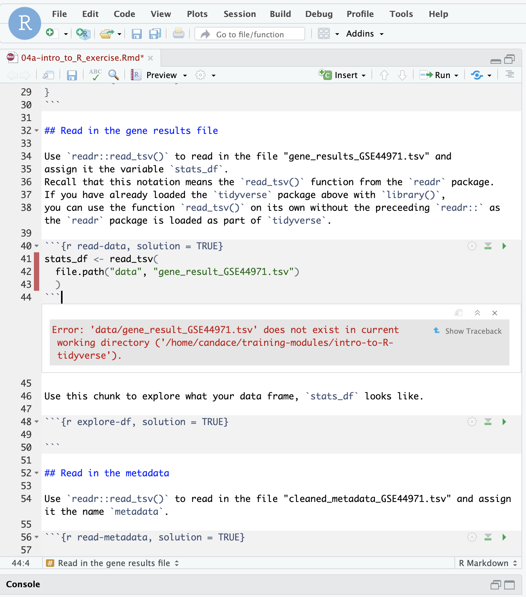

<p></p>
<p style="margin-top: 20px;"> </p>
<p>We use the <b>Cancer Data Science Slack</b> for communication.
If you haven't yet joined Cancer Data Science Slack, you will need to follow the [set up procedures described here](../virtual-setup/slack-procedures.md).

During and after the workshop, we encourage you to post your coding questions to your Slack training channel. But, asking questions about code in such a way that others can readily help you can be tricky and is a skill itself!

Here we've laid out some guidelines for posting your question so that your peers and the CCDL team will more readily be able to help you reach a solution!

**Your posting should include information that answers these four points:**

- What is the goal of this code?
- Where is this error occurring (notebook/line/chunk)?
- What code that is producing this error? (including it formatted is helpful!)
- What is the error or problematic outcome? (include error messages verbatim)

*Optionally:*
- What things have you tried thus far?

To demonstrate what this looks like, we will walk through an example here:

## Troubleshooting example

In this example, I'm using our exercise notebook, `04a-intro_to_R_exercise.Rmd`.

Below I'm showing a screenshot of what this error would look like when encountering it in [our RStudio Server](../virtual-setup/rstudio-login.md)



#### Step 1) Do what you can to try to solve the error yourself (but don't tire yourself out!)

The best way to learn how to solve errors in code is to figure them out yourself.
So try to explore the error a bit - but we are also here to help you so don't hesitate to ask for help! (If you are feeling exasperated by your error, skip to Step 2.

We recommend looking over our [debugging guide](https://github.com/AlexsLemonade/training-modules/blob/master/intro-to-R-tidyverse/00b-debugging_resources.md) which can explain what some of the most common errors mean.
The debugging guide also has tips on first steps to take which may help you get to the root of the problem.

**Some quick things to try:**
- Try to identify which part of your code appears to be the problem through trying smaller parts of the code and seeing if the error still occurs (called chunking)


- Go back to the beginning of your notebook and re-run your code in order and make sure you haven't missed any vital steps! Order matters!

#### Step 2) Draft out your question.

You may want to open up a text editor to write this out before posting (this is a personal preference thing).

For our example error ...


... here's how each of the "four points" could be included:

**Where is this error occurring; what <ins>notebook/line/chunk</ins>?:**  
- In our workshop, notebook references tend to make sense to provide, however, more generally this should be any context around __where__ you've encountered this error.

*For our example:* 

**What is the <ins>goal of this code</ins>?**  

- Providing context around your end goals for this code will help others tailor their advice toward your goal as well as helping the understand what you are working toward.


**What is <ins>the code</ins> that is producing this error? (including it formatted is helpful!):**

- [*In Slack, you can/should use backticks to format your code.*](#adding-code-blocks-to-messages)
- *Screenshots make it so people can't copy-paste your code to try it themselves so pasting the code wiith backticks makes it easiest for others to help you.*


**What is <ins>the error</ins> or problematic outcome? (include error messages verbatim):**  


**What <ins>have you tried</ins> thus far?:**  


#### Step 3) Post to Slack!

Navigate to your particular workshop's training channel.

Ideally you can post everything in one post and all responses to your question will be in your posts' Slack thread (more on that).
You can feel free to keep the our questions in as headers if you like but that is up to you.


#### Adding code blocks to messages

Code and error messages are usually easier to read when you use code formatting in Slack.
You can either select the code block icon below the message field:


Or you can type three backticks <code>```</code> into the message field and formatting will be applied:


You are then ready to paste your code or error message into the grey code block.

**If you have questions or are having trouble with Slack features, please reach out to us via direct message or, if direct messaging is not working, please email [training@ccdatalab.org](mailto:training@ccdatalab.org).**


## Code question points to include checklist
- [ ] The goal of this code I'm working on
- [ ] The notebook/line/script that this error was encountered in
- [ ] The code that is showing an error is included and formatted
- [ ] The error or problematic outcome is included verbatim or otherwise described
